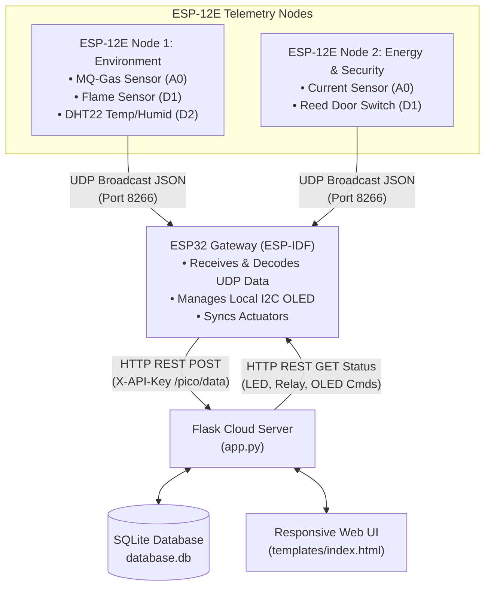

# Distributed Industrial IoT Monitoring & Automation System 🔌🤖

A secure, multi-node industrial IoT telemetry and automation ecosystem designed for real-time hazard detection, energy consumption tracking, and remote control of hardware actuators. 

This system integrates distributed **ESP-12E Sensor Nodes** broadcasting JSON telemetry over local networks, a central **ESP32 Gateway** running native **FreeRTOS (ESP-IDF)**, and a **Python Flask Web Server** providing visual tracking, data logging, and interactive controls.

---

## 📐 System Architecture

The following diagram illustrates the flow of telemetry data from the sensors to the cloud, and control commands from the dashboard back to the physical actuators:



---

## 🛠️ Features

### 1. Hardware & Firmware
* **ESP-12E Node 1 (Environment)**: Reads DHT22 (temperature/humidity), MQ gas sensor, and digital flame sensor. Broadcasts values formatted as JSON over UDP.
* **ESP-12E Node 2 (Energy & Security)**: Features RMS AC current calculation (using an analog current sensor with zero-point offset auto-calibration) and magnetic reed door switch state monitoring.
* **ESP32 Central Gateway (ESP-IDF)**:
  * Programmed in native C using **FreeRTOS** tasks for modular processing.
  * Launches a Wi-Fi Provisioning Hotspot if no credentials are saved in NVS (Non-Volatile Storage).
  * Socket-listens for local UDP broadcasts (port `8266`) and decodes JSON packets utilizing `cJSON`.
  * Communicates with the Flask Cloud API securely using HTTPS REST client with custom authorization keys (`X-API-Key`).
  * Drives local peripherals like I2C SSD1306 OLED displays, status indicators, and relays based on central dashboard commands.

### 2. Cloud Server & Web Dashboard
* **Flask REST API**: Manages telemetry endpoints, evaluates thresholds (e.g., triggering alarm modes if gas > threshold or flame == true), and synchronizes actuator states.
* **SQLite Persistence**: Logs all sensor activities and settings using WAL (Write-Ahead Logging) mode for thread-safe operations.
* **Responsive HTML5/CSS3 Dashboard**:
  * Real-time monitoring of Node 1 and Node 2.
  * Direct manual override toggle for relays, alarm LEDs, and custom OLED display messages.
  * Sleek dark mode UI built with responsive layout grids.

---

## 📂 Directory Structure

```
fkstech-iot/
├── app.py                   # Python Flask Web Application & REST API
├── requirements.txt         # Python libraries (Flask, Flask-Cors, Gunicorn)
├── database.db              # SQLite Database (Auto-created, stores sensor history)
├── templates/
│   └── index.html           # Responsive monitoring dashboard
└── src/
    ├── CMakeLists.txt       # ESP-IDF CMake configuration
    ├── main.c               # ESP32 Gateway Firmware (ESP-IDF C / FreeRTOS)
    ├── esp12e_main.cpp      # ESP-12E Node 1 Firmware (Arduino C++)
    ├── esp12e_node2.cpp     # ESP-12E Node 2 Firmware (Arduino C++)
    ├── cJSON.c / cJSON.h    # JSON encoder/decoder helper
    └── wifi_prov.h          # WiFi provisioning library header
```

---

## ⚙️ Setup & Deployment

### 1. Flask Web Server Setup
1. Install Python dependencies:
   ```bash
   pip install -r requirements.txt
   ```
2. Start the development server:
   ```bash
   python app.py
   ```
   *The application will boot and initialize the SQLite database (`database.db`).*

### 2. ESP-12E Sensor Nodes (Arduino IDE)
1. Open `src/esp12e_main.cpp` (Node 1) or `src/esp12e_node2.cpp` (Node 2) in the Arduino IDE.
2. Ensure ESP8266 board support is installed.
3. Flash the code onto the microcontrollers.
4. During initial boot, connect to the WiFi provisioning access point (`Setup-Node1` / `Setup-Node2`) to set your local network SSID and password.

### 3. ESP32 Gateway (ESP-IDF)
1. Configure your target URL and API key inside `src/main.c`:
   ```c
   #define SERVER_URL     "http://<your-server-ip>:<port>/pico/data"
   #define STATUS_URL     "http://<your-server-ip>:<port>/status"
   #define API_KEY        "tasarim_projesi_secret_key"
   ```
2. Build and flash using ESP-IDF:
   ```bash
   idf.py set-target esp32
   idf.py build
   idf.py flash monitor
   ```

---

## 🔒 Security
All telemetry transmissions between the gateway and cloud are validated by a header verification step checking the API credential:
```http
X-API-Key: <your_secret_key>
```
Unauthorized requests receive a `401 Unauthorized` response to prevent malicious spoofing of sensor states.
